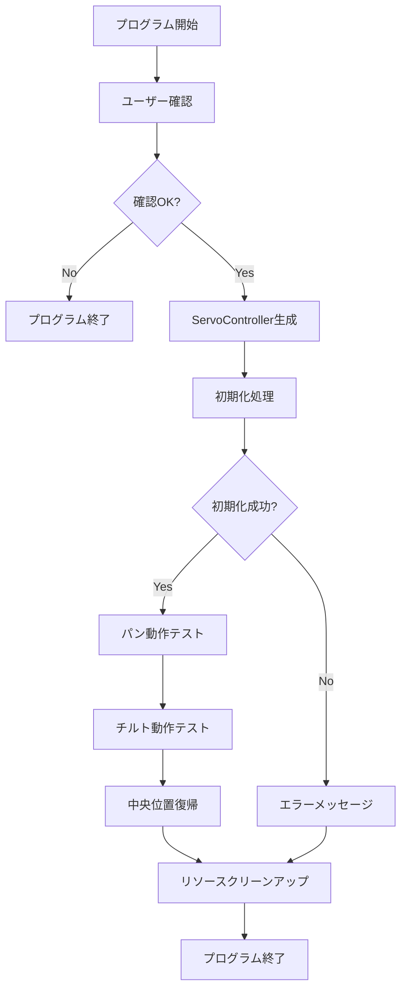
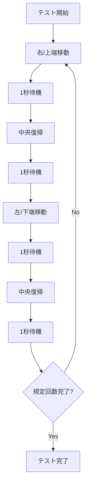

# サーボテストプログラム システム仕様書

## 文書情報
- **プログラム名**: servo_test.py
- **バージョン**: 1.0.0
- **作成日**: 2025-07-20
- **対象**: パン・チルト機構動作確認テストプログラム

## 1. 概要

### 1.1 プログラム目的
Adafruit PCA9685 PWMサーボドライバとSG90サーボモータを使用したパン・チルト機構の動作確認を行うテストプログラムです。メインのペット追跡アプリケーション開発前に、ハードウェアの正常性とサーボ制御の基本動作を検証します。

### 1.2 主要機能
- サーボドライバ（PCA9685）の初期化
- パン（左右）サーボの動作テスト
- チルト（上下）サーボの動作テスト
- 安全範囲内での動作制御
- エラーハンドリングと適切なリソース管理

### 1.3 対象ハードウェア
| コンポーネント | 型番/仕様 | 用途 |
|---|---|---|
| Raspberry Pi | Pi 5 | プログラム実行環境 |
| PWMサーボドライバ | Adafruit PCA9685 (SKU:2327) | サーボモータ制御 |
| サーボモータ | SG90 × 2台 | パン・チルト機構 |
| パン・チルトマウント | Switch Science SKU:3486 | カメラマウント機構 |

## 2. システム構成

### 2.1 ソフトウェア構成
```
servo_test.py
├── ServoController クラス
│   ├── 初期化メソッド
│   ├── サーボ制御メソッド
│   ├── テスト実行メソッド
│   └── クリーンアップメソッド
├── シグナルハンドラ
└── メイン実行部
```

### 2.2 ハードウェア接続
```
Raspberry Pi 5
├── I2C (SCL/SDA) → PCA9685サーボドライバ
└── PCA9685
    ├── チャンネル0 → パンサーボ (SG90)
    └── チャンネル1 → チルトサーボ (SG90)
```

### 2.3 依存ライブラリ
- `board`: Raspberry Pi GPIO制御
- `busio`: I2C通信
- `adafruit_pca9685`: PCA9685ドライバ制御
- `adafruit_motor.servo`: サーボモータ制御

## 3. クラス仕様

### 3.1 ServoController クラス

#### 3.1.1 クラス概要
パン・チルトサーボの制御を行うメインクラスです。サーボドライバの初期化から動作テスト、リソース管理まで一元的に処理します。

#### 3.1.2 クラス属性
| 属性名 | 型 | 説明 |
|---|---|---|
| `i2c` | busio.I2C | I2C通信インスタンス |
| `pca` | PCA9685 | PWMサーボドライバインスタンス |
| `pan_servo` | servo.Servo | パンサーボ制御インスタンス |
| `tilt_servo` | servo.Servo | チルトサーボ制御インスタンス |
| `PAN_CENTER` | int | パン中央位置 (90度) |
| `TILT_CENTER` | int | チルト中央位置 (90度) |
| `PAN_MIN` | int | パン最小角度 (0度) |
| `PAN_MAX` | int | パン最大角度 (180度) |
| `TILT_MIN` | int | チルト最小角度 (45度) |
| `TILT_MAX` | int | チルト最大角度 (135度) |
| `MOVE_DELAY` | float | 動作間隔 (1.0秒) |
| `SETTLE_DELAY` | float | 動作後安定待機時間 (0.5秒) |

## 4. メソッド仕様

### 4.1 `__init__(self)`
#### 目的
ServoControllerクラスのコンストラクタ。各種パラメータの初期化を行います。

#### 引数
なし

#### 戻り値
なし

#### 処理詳細
- インスタンス変数の初期化
- サーボ角度パラメータの設定
- 動作タイミングパラメータの設定

---

### 4.2 `initialize(self) -> bool`
#### 目的
I2C通信、PCA9685サーボドライバ、およびサーボモータの初期化を行います。

#### 引数
なし

#### 戻り値
- `True`: 初期化成功
- `False`: 初期化失敗

#### 処理詳細
1. I2Cバスの初期化 (SCL/SDA)
2. PCA9685の初期化と50Hz設定
3. パンサーボ (チャンネル0) の初期化
4. チルトサーボ (チャンネル1) の初期化
5. 両サーボを中央位置に移動
6. 2秒間の初期位置安定化待機

#### 例外処理
- 初期化エラー時はエラーメッセージを出力してFalseを返す

---

### 4.3 `move_pan(self, angle: float) -> None`
#### 目的
パンサーボを指定角度に移動させます。

#### 引数
- `angle` (float): 移動先角度 (0-180度)

#### 戻り値
なし

#### 処理詳細
1. 角度の範囲チェック (0-180度に制限)
2. サーボ角度の設定
3. 0.5秒の安定化待機
4. 移動ログの出力

#### 安全機能
- 入力角度を安全範囲内に自動制限

---

### 4.4 `move_tilt(self, angle: float) -> None`
#### 目的
チルトサーボを指定角度に移動させます。

#### 引数
- `angle` (float): 移動先角度 (45-135度の安全範囲)

#### 戻り値
なし

#### 処理詳細
1. 角度の範囲チェック (45-135度に制限)
2. サーボ角度の設定
3. 0.5秒の安定化待機
4. 移動ログの出力

#### 安全機能
- 入力角度を安全範囲内に自動制限（物理的制約を考慮）

---

### 4.5 `test_pan_movement(self, cycles: int = 3) -> None`
#### 目的
パン（左右）動作の連続テストを実行します。

#### 引数
- `cycles` (int): テスト回数 (デフォルト: 3)

#### 戻り値
なし

#### 処理詳細
各サイクルで以下の動作を実行:
1. 右端 (180度) に移動 → 1秒待機
2. 中央 (90度) に復帰 → 1秒待機  
3. 左端 (0度) に移動 → 1秒待機
4. 中央 (90度) に復帰 → 1秒待機

#### テスト項目
- 全可動範囲での正常動作
- 動作精度と安定性
- 中央位置への正確な復帰

---

### 4.6 `test_tilt_movement(self, cycles: int = 3) -> None`
#### 目的
チルト（上下）動作の連続テストを実行します。

#### 引数
- `cycles` (int): テスト回数 (デフォルト: 3)

#### 戻り値
なし

#### 処理詳細
各サイクルで以下の動作を実行:
1. 上端 (135度) に移動 → 1秒待機
2. 中央 (90度) に復帰 → 1秒待機
3. 下端 (45度) に移動 → 1秒待機  
4. 中央 (90度) に復帰 → 1秒待機

#### テスト項目
- 安全範囲内での正常動作
- 動作精度と安定性
- 中央位置への正確な復帰

---

### 4.7 `return_to_center(self) -> None`
#### 目的
両サーボを中央位置に復帰させます。

#### 引数
なし

#### 戻り値
なし

#### 処理詳細
1. パンサーボを90度に設定
2. チルトサーボを90度に設定
3. 1秒間の安定化待機
4. 復帰完了ログの出力

---

### 4.8 `cleanup(self) -> None`
#### 目的
プログラム終了時のリソースクリーンアップを実行します。

#### 引数
なし

#### 戻り値
なし

#### 処理詳細
1. 全PWMチャンネルの出力停止 (duty_cycle = 0)
2. PCA9685ドライバの終了処理
3. クリーンアップ完了ログの出力

#### 例外処理
- クリーンアップ中のエラーもキャッチして安全に終了

## 5. 関数仕様

### 5.1 `signal_handler(signum, frame)`
#### 目的
Ctrl+C（SIGINT）やSIGTERMシグナルを受信した際の安全停止処理を行います。

#### 引数
- `signum`: シグナル番号
- `frame`: フレームオブジェクト

#### 戻り値
なし（プログラム終了）

#### 処理詳細
1. 割り込み検出メッセージの表示
2. サーボの中央位置復帰
3. リソースのクリーンアップ
4. プログラムの安全終了

---

### 5.2 `main()`
#### 目的
プログラムのメイン実行関数です。

#### 引数
なし

#### 戻り値
なし

#### 処理詳細
1. プログラム開始メッセージとユーザー確認
2. シグナルハンドラの設定
3. ServoControllerインスタンスの生成
4. 初期化処理
5. パン動作テスト実行 (3回)
6. チルト動作テスト実行 (3回)
7. 中央位置復帰
8. リソースクリーンアップ

#### エラーハンドリング
- 初期化失敗時の適切なメッセージ表示
- テスト中例外の捕捉と表示
- 必ずfinallyブロックでリソース解放

## 6. システムインターフェース

### 6.1 ハードウェアインターフェース
#### I2C通信
- **プロトコル**: I2C
- **アドレス**: 0x40 (PCA9685デフォルト)
- **クロック**: 400kHz (Fast Mode)
- **ピン接続**: 
  - SCL → GPIO 3
  - SDA → GPIO 2

#### PWM出力
- **周波数**: 50Hz (サーボ標準)
- **パルス幅**: 1.0ms～2.0ms (SG90標準)
- **チャンネル**: 
  - Ch0: パンサーボ
  - Ch1: チルトサーボ

### 6.2 ソフトウェアインターフェース
#### 標準出力
```
プログラム開始メッセージ
サーボドライバを初期化中...
サーボを中央位置に設定中...
サーボドライバの初期化が完了しました

=== パン動作テスト開始（3回往復） ===
パンテスト 1/3回目:
パン: 180度に移動
パン: 90度に移動
...

テスト完了メッセージ
```

#### エラー出力
```
必要なライブラリがインストールされていません: [エラー内容]
サーボドライバの初期化に失敗しました: [エラー内容]
テスト中にエラーが発生しました: [エラー内容]
```

## 7. 動作フロー

### 7.1 メイン処理フロー


### 7.2 サーボテスト処理フロー


## 8. エラーハンドリング

### 8.1 想定エラーケース
| エラー種別 | 原因 | 対応処理 |
|---|---|---|
| ImportError | ライブラリ未インストール | インストールコマンド表示後終了 |
| I2C通信エラー | ハードウェア接続不良 | エラーメッセージ表示後終了 |
| PCA9685初期化エラー | ドライバボード不良 | エラーメッセージ表示後終了 |
| KeyboardInterrupt | ユーザーによる中断 | 安全停止処理実行 |
| 一般例外 | 予期しないエラー | エラー内容表示、クリーンアップ実行 |

### 8.2 復旧処理
1. **シグナル受信時**: 中央位置復帰 → クリーンアップ → 終了
2. **初期化失敗時**: エラーメッセージ表示 → 終了
3. **テスト中エラー**: エラー表示 → クリーンアップ → 終了

## 9. 安全設計

### 9.1 角度制限
- **パン角度**: 0度～180度（物理的制限内）
- **チルト角度**: 45度～135度（安全マージン確保）

### 9.2 動作速度制御
- **移動後待機**: 0.5秒（サーボ安定化）
- **動作間隔**: 1.0秒（過負荷防止）

### 9.3 フェイルセーフ機能
- 角度範囲の自動制限
- シグナルハンドラによる緊急停止
- 確実なリソース解放処理

## 10. テスト項目

### 10.1 機能テスト
- [ ] サーボドライバ初期化確認
- [ ] パン動作範囲確認（0度～180度）
- [ ] チルト動作範囲確認（45度～135度）
- [ ] 中央位置復帰確認
- [ ] 連続動作安定性確認

### 10.2 安全性テスト
- [ ] 角度制限機能確認
- [ ] Ctrl+C割り込み処理確認
- [ ] エラー時安全停止確認
- [ ] リソース解放確認

### 10.3 ユーザビリティテスト
- [ ] 操作手順の明確性
- [ ] エラーメッセージの分かりやすさ
- [ ] 進行状況表示の適切性

---

## 改訂履歴
| バージョン | 日付 | 変更内容 | 作成者 |
|---|---|---|---|
| 1.0.0 | 2025-07-20 | 初版作成 | Claude |